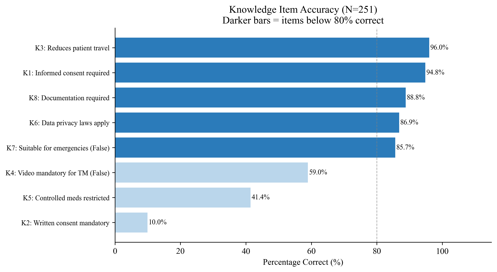
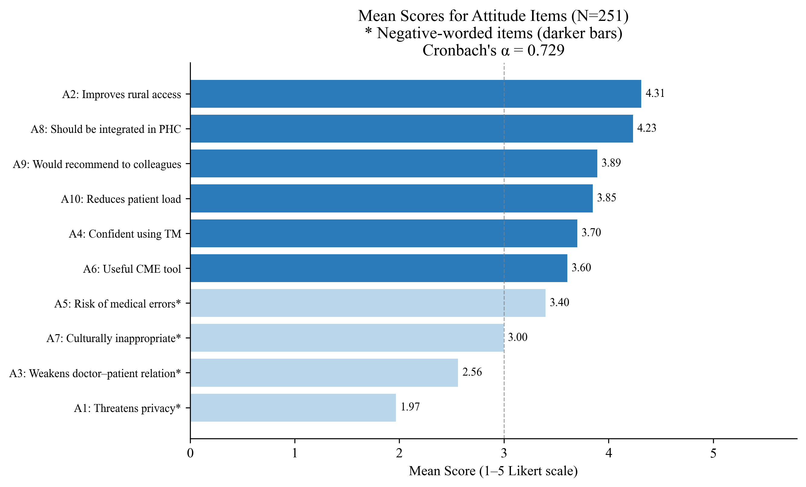
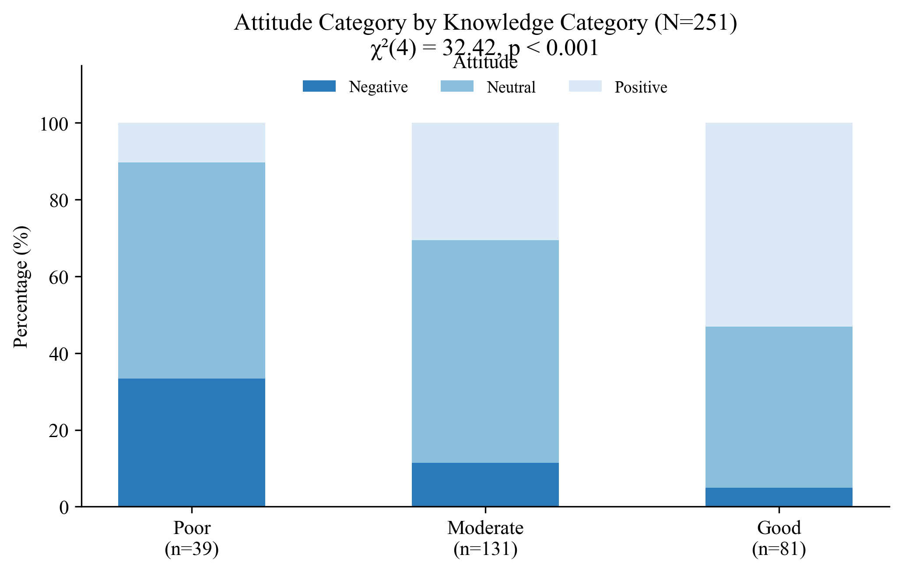

# Knowledge, Attitudes, and Practices Toward Telemedicine Among Primary Healthcare Physicians in Sudan — 2026

**Study type:** Cross-sectional, facility-based descriptive study

**Degree level:** Clinical Master Degree in Family Medicine (Sudan Medical Specializations Board)

**Institution:** University of Gezira, Faculty of Medicine

**Sample size:** N = 251 primary healthcare physicians

**Data analyst:** Abdulrahman Sirelkhatim

---

## Background

Telemedicine — the delivery of healthcare services through digital communication technologies
across geographic distances — has undergone rapid global expansion, accelerated significantly
by the COVID-19 pandemic. The World Health Organization recognises telemedicine as a critical
mechanism for improving healthcare access, particularly in countries with limited medical
infrastructure, unequal geographic distribution of services, and high patient-to-physician
ratios. International evidence consistently shows that telemedicine can reduce patient travel
costs, improve continuity of care for chronic disease management, support specialist
consultations in underserved areas, and maintain healthcare delivery during public health
emergencies.

Sudan faces a compounding set of structural healthcare challenges: a severe shortage of
healthcare workers concentrated in urban centres, limited and deteriorating infrastructure
in rural and peri-urban settings, restricted access to specialist care across most states,
and an ongoing armed conflict since April 2023 that has further destabilised health service
delivery. Primary healthcare physicians serve as the frontline of the health system and are,
in most communities, the only consistently accessible medical professionals. Their knowledge
of telemedicine, attitudes toward its integration into practice, and current adoption
patterns are therefore directly relevant to whether telemedicine can function as a viable
healthcare delivery strategy in Sudan.

Despite growing international and regional evidence on telemedicine KAP among healthcare
workers, published research specific to Sudan's primary care workforce remains sparse and
methodologically limited. The handful of Sudanese studies identified — conducted in Khartoum,
Gezira, and Port Sudan — focused on awareness and readiness rather than structured KAP
assessment, and none used validated scoring instruments. This study addresses that gap by
applying a structured KAP framework across a geographically diverse national sample,
providing the first comprehensive baseline characterisation of telemedicine knowledge,
attitudes, and practices among Sudanese primary healthcare physicians.

## Objectives

- Assess the level of knowledge regarding telemedicine among primary healthcare physicians
  in Sudan
- Determine physicians' attitudes toward telemedicine services
- Assess current telemedicine practices, platforms used, and consultation volumes
- Identify barriers affecting the use of telemedicine among physicians
- Determine sociodemographic and professional factors associated with knowledge, attitudes,
  and practices toward telemedicine

## Study Design & Methods

| Component | Detail |
|-----------|--------|
| Design | Cross-sectional, facility-based descriptive |
| Setting | Selected primary healthcare centers across multiple Sudanese states |
| Population | All PHC physicians working in selected centers during the study period |
| Sampling | Multistage: states and PHC centers selected randomly; eligible physicians invited |
| Sample size | n = 251 (Cochran's formula: Z=1.96, p=50%, d=5%, N=384 adjusted for eligibility) |
| Data collection | Structured self-administered questionnaire (March–June 2026) |
| Eligibility | PHC physician currently working in Sudan; written informed consent |

**Instrument structure:**

| Section | Items | Scale | Score range |
|---------|-------|-------|-------------|
| Knowledge (C1–C8) | 8 True/False/Don't Know items | Correct = 1, Incorrect/DK = 0 | 0–8 |
| Attitudes (D1–D10) | 10 Likert items | Strongly Disagree=1 to Strongly Agree=5 | 10–50 |
| Practices (E1–E7) | Binary use, ordinal volume, ordinal documentation | Composite 0–3 | 0–3 |

**Scoring cut-offs:**

| Domain | Poor / Negative / Low | Moderate / Neutral | Good / Positive / High |
|--------|----------------------|--------------------|------------------------|
| Knowledge | 0–4 | 5–6 | 7–8 |
| Attitude | <30 | 30–39 | 40–50 |
| Practice | 0 | 1 | 2–3 |

Attitude scoring applies reverse-coding to four negative items (A1, A3, A5, A7) so that
higher scores consistently reflect more favourable attitudes.

**Technical suite:**

| Tool | Purpose |
|------|---------|
| Python (pandas) | Data cleaning, eligibility filtering, column renaming, variable recoding, multi-select expansion, score computation |
| IBM SPSS Statistics v26 | Full statistical analysis |
| Python (matplotlib, seaborn) | Figure generation |
| Jupyter Notebook | Exploratory data analysis |

**Statistical methods:**

- **Reliability:** Cronbach's Alpha for the 10-item attitude scale
- **Descriptive:** Frequencies, percentages, means, SDs; item-level response distributions
  and accuracy rates; multi-select frequency tables for platforms, barriers, and support needs
- **Bivariate:** Chi-square tests (Fisher's Exact where expected cell count < 5) for
  associations between sociodemographic variables and each KAP category; chi-square for
  KAP inter-domain associations
- **Multivariate:** Binary logistic regression (outcome: telemedicine use in past 6 months);
  enter method; OR with 95% CI reported

## Dataset

| File | Description |
|------|-------------|
| `1_data/raw/raw_data.xlsx` | Raw Google Form export; includes ineligible responses (non-PHC physicians) |
| `1_data/cleaned/cleaned_data.xlsx` | Cleaned dataset: eligibility-filtered, numeric-coded demographics, binary knowledge items, reverse-coded attitude items with composite score, ordinal practice variables, multi-select binary dummies, KAP scores and categories |

> **Privacy note:** Raw data is excluded from version control. The cleaned file retains no

> individual identifiers; participant phone numbers were not collected (anonymous questionnaire).

## Repository Structure

```text
telemedicine-kap-phc-physicians-sudan-2026/
│
├── README.md
├── .gitignore
├── .ls-lint.yml
├── .markdownlint.yml
├── .markdownlintignore
│
├── .github/
│   └── workflows/
│       └── ci-checks.yml
│
├── 1_data/
│   ├── raw/                        ← excluded from version control (privacy)
│   └── cleaned/
│       └── cleaned_data.xlsx
├── 2_cleaning/
│   └── cleaning.py
│
├── 3_notebooks/
│   └── exploratory_analysis.ipynb
│
├── 4_analysis/
│   ├── full_analysis.sps
│   └── figures.py
│
├── 5_figures/
│
└── 6_docs/
    └── results_chapter.docx
```

## Key Results

### Scale Reliability

The 10-item attitude scale achieved acceptable internal consistency (Cronbach's α = 0.729).
Knowledge and practice scales were not assessed for reliability due to their mixed binary
and ordinal structure; item-level accuracy rates are reported instead.

### Demographic Profile

The sample of 251 PHC physicians was predominantly female (72.1%, n=181) and concentrated
in the 30–39 age group (43.0%). Most participants worked in urban settings (66.1%), with
20.7% peri-urban and 13.1% rural. By qualification, 40.6% held MBBS, 26.7% were Family
Medicine Specialists, 16.7% MD/MS, and 15.5% General Practitioners. Experience was
distributed across all categories, with 45.8% having 1–5 years in PHC. Only 17.9% (n=45)
had received any formal telemedicine training.

### Knowledge of Telemedicine

The mean knowledge score was 5.63 (SD = 1.46) out of 8, with 52.2% classified as Moderate
and 32.3% as Good. High-awareness items included reducing patient travel (K3: 98.4% correct)
and data privacy obligations (K6: 96.9% correct). The three items with the highest Don't
Know rates — controlled medication restrictions (K5: 42.6%), mandatory video consultation
(K4: 31.9%), and written consent requirements (K2: 27.5%) — reflect specific regulatory
knowledge gaps directly relevant to safe and compliant practice.

### Attitudes Toward Telemedicine

The mean attitude score was 36.67 (SD = 6.08) out of 50, with 53.0% classified as Neutral
and 34.7% as Positive. The highest-rated positive items were rural healthcare access
improvement (A2: mean 4.31) and PHC integration (A8: mean 4.23). The privacy threat item
(A1: mean 1.97) indicated that most physicians did not perceive telemedicine as a privacy
risk. Medical error risk (A5: mean 3.40) showed moderate concern. The striking attitudinal
shift among trained physicians (75.6% Positive vs 25.7% among untrained, χ²(2) = 49.97,
p < 0.001) is the study's most actionable finding.

### Telemedicine Practices

A high proportion of physicians (87.6%) reported using telemedicine in the past six months,
though this figure must be contextualised by the broad operational definition that includes
regular phone calls (used by 86.5%). WhatsApp was used by 59.4%, while the official Sudan
Health Platform was used by only 4.8%, indicating near-absent adoption of formal national
digital health infrastructure. Documentation practices were concerning: only 17.9% always
documented telemedicine consultations, and 18.7% never documented — a patient safety and
medico-legal concern. The desire for further training was high (83.3%).

| Practice Indicator | n | % |
|--------------------|---|---|
| Used TM in past 6 months | 220 | 87.6 |
| 0–2 consultations/month | 74 | 29.5 |
| 3–5 consultations/month | 57 | 22.7 |
| 6–10 consultations/month | 60 | 23.9 |
| >10 consultations/month | 60 | 23.9 |
| Documents always | 45 | 17.9 |
| Documents never | 47 | 18.7 |
| Want further training | 209 | 83.3 |

### Bivariate Analysis

Age, years of experience, qualification, and telemedicine training were significantly
associated with both knowledge and attitude categories (all p < 0.001 or p < 0.01). Gender
and work setting were not significant for either domain. The knowledge–attitude association
was highly significant (χ²(4) = 32.42, p < 0.001), with 53.1% of good-knowledge physicians
holding positive attitudes vs 10.3% of poor-knowledge physicians.

For telemedicine use (binary), age group (p = 0.003), years of experience (p = 0.003),
knowledge category (p = 0.006), and attitude category (p = 0.001) were significant.
Practice category showed the broadest significant associations, with work setting also
emerging (χ²(4) = 10.33, p = 0.035) — rural physicians showed lower high-practice
prevalence (57.6%) versus urban (78.3%) and peri-urban (80.8%).

### Multivariate Analysis

Binary logistic regression for telemedicine use in the past six months identified positive
attitude as the strongest independent predictor. The overall model was statistically
significant (χ²(8) = significant, p < 0.05).

| Predictor | Adjusted OR (95% CI) | p-value |
|-----------|----------------------|---------|
| Age 30–39 vs 20–29 | 6.32 (1.39–28.73) | 0.017 |
| Age 40–49 vs 20–29 | 3.87 (0.67–22.28) | 0.130 |
| Female vs Male | 1.09 (0.35–3.47) | 0.879 |
| Peri-urban vs Urban | 0.92 (0.28–3.05) | 0.886 |
| Rural vs Urban | 0.58 (0.19–1.82) | 0.351 |
| GP vs MBBS | 11.35 (1.79–72.09) | 0.010 |
| FM Specialist vs MBBS | 1.04 (0.31–3.45) | 0.953 |
| MD/MS vs MBBS | 1.93 (0.35–10.62) | 0.451 |
| TM Training (Yes vs No) | 0.53 (0.13–2.23) | 0.388 |
| Knowledge Moderate vs Poor | 1.36 (0.40–4.60) | 0.622 |
| Knowledge Good vs Poor | 5.34 (0.93–30.78) | 0.061 |
| Attitude Neutral vs Negative | 2.82 (0.87–9.18) | 0.085 |
| Attitude Positive vs Negative | 7.26 (1.73–30.41) | 0.007 |

***OR and 95% CI from SPSS logistic regression output (Table 11 in results chapter)***

Neither knowledge category nor telemedicine training reached significance in the
multivariate model, suggesting their effects are mediated through attitude or confounded
by other predictors.

## Selected Figures

**Knowledge Item Accuracy**


**Attitude Item Mean Scores**


**Attitude Category by Knowledge Category**


## Limitations

- **Urban overrepresentation:** 66.1% of participants worked in urban settings, limiting
  generalizability to rural PHC contexts where telemedicine need is greatest.
- **Self-reported practices:** Telemedicine use rates (87.6%) likely reflect the broad
  operational definition including informal phone consultations; structured digital
  telemedicine adoption is likely substantially lower.
- **Wide CI in logistic regression:** Several OR estimates had very wide confidence
  intervals due to small subgroup sizes (e.g. GP n=39, trained n=45), reducing precision.
- **Cross-sectional design:** Causal direction between training, knowledge, attitudes, and
  practice cannot be established.
- **Single-outcome regression:** The logistic model predicts binary telemedicine use only;
  a more informative outcome would be structured practice quality or documentation
  compliance, which were not modelled due to data constraints.
- **Conflict context:** Data collection during active conflict may have affected response
  patterns and access to certain states, potentially introducing geographic selection bias.

## Files

| Script | Purpose |
|--------|---------|
| `2_cleaning/cleaning.py` | Filters to consenting PHC physicians, renames columns by position, recodes demographics and knowledge items to numeric, reverse-codes negative attitude items, computes KAP scores and categories, expands multi-select columns to binary dummies |
| `3_notebooks/exploratory_analysis.ipynb` | EDA: data quality checks, demographic profile, KAP score distributions, item-level accuracy and means, preliminary chi-square associations, Spearman correlation analysis |
| `4_analysis/figures.py` | All 12 figures generated from cleaned data |
| `4_analysis/full_analysis.sps` | SPSS syntax: variable and value labels, reliability, descriptives, item-level frequencies, chi-square bivariate analysis for all KAP domains, binary logistic regression |

---

**Data analyst:** *Abdulrahman Sirelkhatim | Analysis conducted May 2026*
